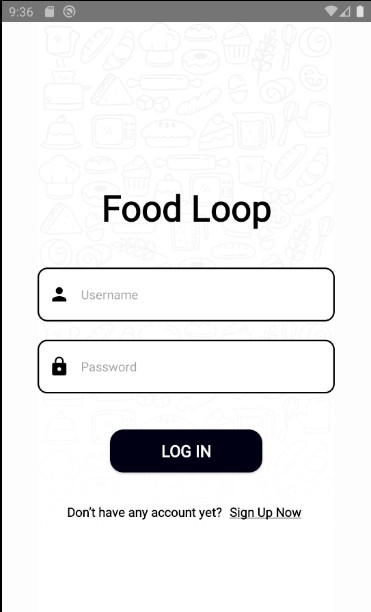
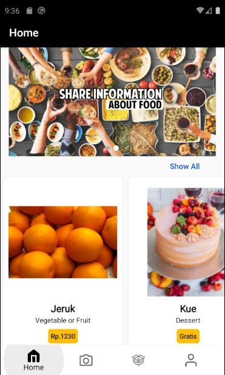
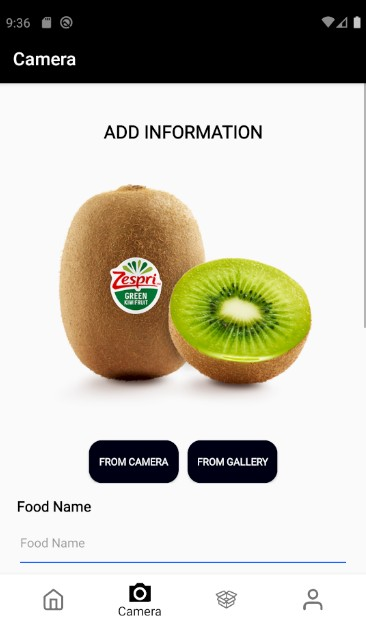
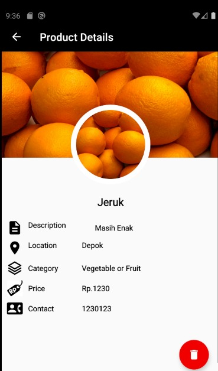
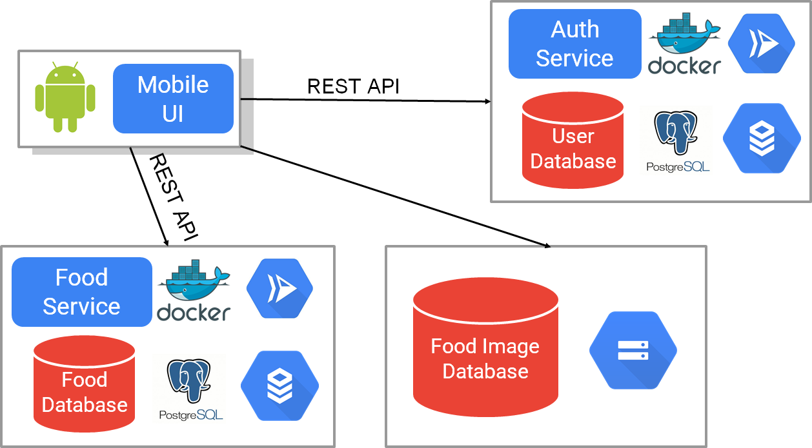
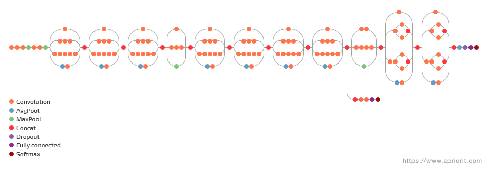
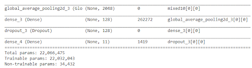

# FoodLoop Mobile Application

## 1. What is FoodLoop?

FoodLoop is an Android-based application to enable people to share food people around in need. User can upload the edible and proper food via FoodLoop and people around can see it. We hope with this application, people can access and get edible and proper at reasonable or even free price.

## 2. A Glimpse of FoodLoop Application

### Login Page

### Home Page

### Upload Page

### Detail Page

### Profile Page

## 3. Implementation

### Android

These following libraries or dependencies were used to create the FoodLoop Application (android):

1. Lottie Library to create splash screen animation.
2. Denzcoskun Library to create animated display image slide contained in Home Page
3. RxJava to create the registration page/activity.
4. Retrofit Library to POST, GET, and DELETE via REST API.
5. Firebase SDK to upload image to the Google Cloud Storage (Bucket)

### Cloud

FoodLoop is using Google Cloud Platform (GCP) for its Backend and Infrastructure

1. Google Cloud Run, to run, deploy, and expose the web service, which had been created before using ExpressJS and containerized using Docker.
2. Google Cloud SQL, to create Database for storing the User Information and Food Informastion.
3. Google Image Registry, to store and save the Docker Image which had been created before to the cloud.
4. Google Storage (Bucket), to store Food Image in the Cloud.
   

### Machine Learning

Foodloop are using the Inception-v3 model and use all the layers in the model except for the last fully connected layer.

API : Tensorflow 2.4
Model : Inception-v3
Epochs = 30
Optimizer : SGD, learning rate 0.0001
Converter Optimization : OPTIMIZE_FOR_SIZE

#### Datasets:

- https://www.kaggle.com/vermaavi/food11
- https://www.kaggle.com/kmader/food41
- https://www.kaggle.com/moltean/fruits

#### Reference Journals/Papers:

- Francesco Ragusa, Valeria Tomaselli, Antonino Furnari, Sebastiano Battiato, and Giovanni M. Farinella. 2016. Food vs Non-Food Classification. In Proceedings of the 2nd International Workshop on Multimedia Assisted Dietary Management (MADiMa '16). Association for Computing Machinery, New York, NY, USA, 77–81. DOI:https://remote-lib.ui.ac.id:2075/10.1145/2986035.2986041
- H. Wurdemann, V. Aminzadeh, J. S. Dai, G. Purnell and J. Reed, "Intrinsic relation between categorisation of food products and processes," 2009 ASME/IFToMM International Conference on Reconfigurable Mechanisms and Robots, 2009, pp. 725-729.
- N. Hnoohom and S. Yuenyong, "Thai fast food image classification using deep learning," 2018 International ECTI Northern Section Conference on Electrical, Electronics, Computer and Telecommunications Engineering (ECTI-NCON), 2018, pp. 116-119, doi: 10.1109/ECTI-NCON.2018.8378293.
